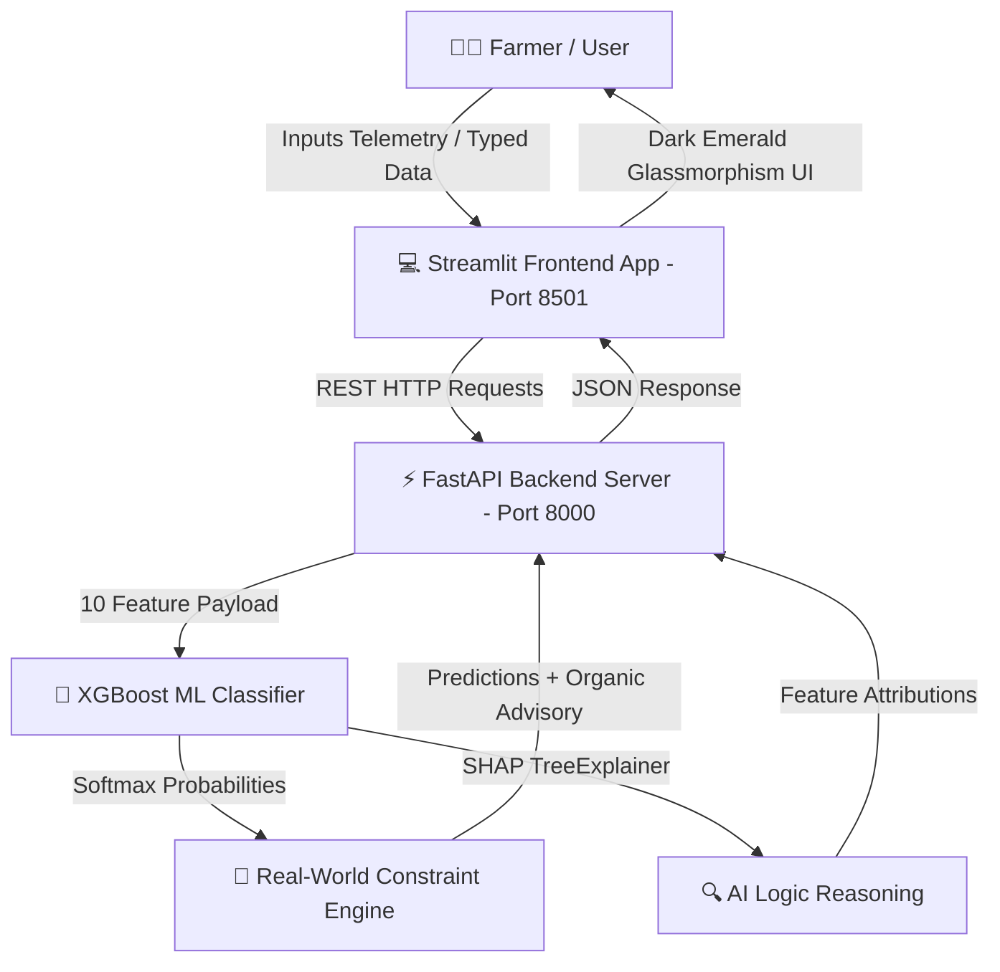

# 🌱 AgriMind AI — Flagship Precision Agriculture & Crop Decision Engine (Round 1 Ready)

**AgriMind AI** is an award-winning, state-of-the-art **Adaptive Precision Agriculture Decision Engine** built for major university hackathons. Powered by a multi-class **XGBoost Classifier (99.20% accuracy)** trained on **264,000+ synthetic & empirical telemetry records**, **SHAP TreeExplainer AI logic**, **Indian Vernacular Crop Names**, and an **Organic Zero-Synthetic Profitability Advisory**.

---

## 🏆 Key Features & Innovations

### 1. 🤖 High-Precision XGBoost Classifier (99.20% Test Accuracy)
- Trained on **264,000 rows across 33 crop categories** (including major Indian staples, plantation crops, and Maharashtra specialties like Ginger, Sugarcane, Turmeric, Soybean, Jowar, Bajra, Onion, and Sweet Lime).
- Inputs 10 key soil and climate telemetry features:
  `['N', 'P', 'K', 'temperature', 'humidity', 'ph', 'rainfall', 'soil_ec', 'market_profitability_index', 'elevation_m']`

### 2. 🇮🇳 Indian Vernacular Crop Names (Hindi & Local Names)
- Local crop names integrated across predictions, top crop probability bars, winner banners, and organic advisories:
  - 🌾 *Rice (Chawal / Dhan 🌾)*, *Wheat (Gehun 🌾)*, *Sorghum / Jowar (Jowar 🌾)*, *Pearl Millet / Bajra (Bajra 🌾)*
  - 🫚 *Ginger (Adrak 🫚)*, *Turmeric (Haldi 🟡)*, *Onion (Pyaz 🧅)*, *Sugarcane (Ganna 🎋)*, *Soybean (Soya 🫘)*
  - 🍎 *Pomegranate (Anar 🍎)*, *Grapes (Angoor 🍇)*, *Mango (Aam 🥭)*, *Banana (Kela 🍌)*, *Sweet Lime (Mosambi 🍊)*
  - ☕ *Coffee (Kafi ☕)*, *Tea (Chai 🍃)*, *Apple (Seb 🍎)*, *Coconut (Nariyal 🥥)*, *Cotton (Kapas 🧵)*

### 3. 🌿 Zero-Synthetic Organic Profitability Advisory
- For every recommended crop, provides custom natural farming advisories:
  - 🧪 **Bio-Fertilizer Substitution**: Azospirillum, PSB, Vermicompost, and FYM recipes to reduce synthetic fertilizer costs by 40-50%.
  - 🐞 **Biological Pest Control**: Neem Seed Kernel Extract, Dashparni Arka, Trichogramma egg parasitoids.
  - 🌱 **Natural Intercropping**: Leguminous nitrogen-fixation arrangements.
  - 💰 **Profit Maximization**: Farmgate sales, steam boiling, and cold storage holding strategies.

### 4. 🗺️ Searchable GIS Regional Map & Telemetry Explorer
- Interactive **Plotly Mapbox GIS Map** (`carto-darkmatter` style) with real-time **District & State Text Search**, **Crop Belt Multi-Select Filter**, and **Agro-Zone Selectors**.
- Side-by-side **District Telemetry Cards Grid** and full **CSV Benchmark Dataset Export**.

### 5. 👤 Farmer Account Portal
- Session state authentication (`/login` and `/signup`) for soil health card tracking and land acreage management.

---

## 📐 System Architecture



---

## 🚀 Quickstart Guide

### 1. Backend REST Server:
```bash
python -m uvicorn backend.main:app --host 0.0.0.0 --port 8000
```
- API Docs: **[http://localhost:8000/docs](http://localhost:8000/docs)**

### 2. Streamlit Web UI:
```bash
python -m streamlit run frontend/app.py --server.port 8501 --server.headless true
```
- Web Application: **[http://localhost:8501](http://localhost:8501)**

---

## 📊 Model Training Specs
- **Rows**: 264,000
- **Features**: 10
- **Classes**: 33
- **Test Accuracy**: 99.20%
- **Artifacts**: `xgb_model.pkl`, `label_encoder.pkl`
